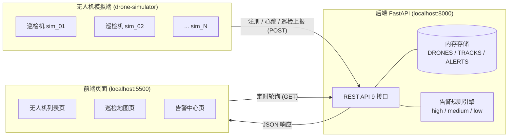

# ARCHITECTURE.md — 无人机森林火情巡检与预警平台 架构说明

## 1. 整体架构拓扑

### 1.1 Mermaid 图



### 1.2 ASCII 备份图

```text
 +---------------------------+        注册 register             +-----------------------------+
 |  无人机模拟端              |        心跳 heartbeat   (POST)    |  后端 FastAPI :8000          |
 |  drone-simulator          | --------------------------------> |                             |
 |  sim_01 / sim_02 / ...    |        巡检上报 telemetry         |  +-----------------------+  |
 |  - 自动注册               |                                   |  | REST API (9 接口)     |  |
 |  - 定时心跳               |                                   |  +-----------+-----------+  |
 |  - 巡检数据 + 异常值      |                                   |              |              |
 +---------------------------+                                   |   +---------+---------+    |
                                                                 |   | 内存存储          |    |
                                                                 |   | DRONES/TRACKS/    |    |
 +---------------------------+        定时轮询 (GET)             |   | ALERTS            |    |
 |  前端页面 :5500            | <-------------------------------- |   +-------------------+    |
 |  - 无人机列表页            |        JSON 响应                  |   | 告警规则引擎      |    |
 |  - 巡检地图页(轨迹/火点)   | --------------------------------> |   | high/medium/low   |    |
 |  - 告警中心页(确认/忽略)   |                                   |   +-------------------+    |
 +---------------------------+                                   +-----------------------------+
```

数据流向一句话总结：模拟端只写（POST 注册/心跳/上报），前端只读（GET 轮询），后端是唯一的内存状态中心。

## 2. 核心流程说明

### 2.1 无人机注册流程
1. 模拟端启动后，为每架无人机生成 `drone_id / name / status / lat / lng / battery / area`。
2. 调用 `POST /api/drones/register`，后端把该无人机写入内存 `DRONES[drone_id]`，并初始化 `last_heartbeat = 当前时间`、建立空轨迹 `TRACKS[drone_id] = []`。
3. 返回 `{ ok: true, drone: {...} }`，其中 `status` 为后端实时计算值。
4. 同一 `drone_id` 重复注册视为覆盖更新（幂等），便于模拟端重启。

### 2.2 心跳与在线判定流程
1. 模拟端每 `heartbeat_interval_sec`（默认 5s）调用一次 `POST /api/drones/{drone_id}/heartbeat`，上报 `status / battery / lat / lng`。
2. 后端刷新该无人机字段并把 `last_heartbeat` 置为当前时间。
3. **在线判定是“读时计算”而非定时任务**：每次 `GET /api/drones` 时，对每架机判断
   `now - last_heartbeat > heartbeat_timeout_sec(默认10s)` → 返回 `offline`，否则返回其自报 `status`（online/cruising/returning）。
4. 好处：无后台线程、无锁竞争，状态永远与“最近一次心跳”一致；未知 `drone_id` 心跳返回 404。

### 2.3 巡检数据上报流程
1. 模拟端每 `report_interval_sec`（默认 3s）调用 `POST /api/telemetry`，上报经纬度、高度、电量、温度、烟雾、火情置信度、可选 image_url。
2. 后端把这条数据追加进 `TRACKS[drone_id]`（形成历史轨迹），并顺带刷新无人机的位置/电量/心跳时间。
3. 同步调用告警规则引擎判定本条数据，若触发告警则一并返回 `{ ok: true, alert: {...} }`，否则 `alert: null`。
4. 轨迹通过 `GET /api/drones/{drone_id}/track?limit=N` 查询，返回最近 N 个点（含温度/烟雾/置信度，供地图着色）。

### 2.4 火情告警生成流程
每条 telemetry 进入规则引擎，**按 high → medium → low 优先级短路判定**，命中最高一档即定级：

- **high（高）**：`fire_confidence >= 0.8` 或 `temperature >= 80` 或 `同区域连续异常 >= 3 次`
- **medium（中）**：`temperature >= 60` 或 `smoke >= 70` 或 `fire_confidence >= 0.6`
- **low（低）**：`temperature >= 50` 或 `smoke >= 50` 或 `fire_confidence >= 0.4`
- 三档都不命中 → 不产生告警。

**“同区域连续异常 ≥ 3 次”逻辑**：维护 `AREA_ABNORMAL_STREAK[area]` 计数器。每条数据只要达到“异常门槛”（温度≥50 或 烟雾≥50 或 置信度≥0.4，即 low 门槛）就把该区域计数 +1，否则清零；当计数达到 3 即使单项未到 high 阈值也升级为 high，用于捕捉“持续阴燃”这类单点不极端但区域持续异常的情形。

告警记录字段：`alert_id（uuid）/ drone_id / lat / lng / level / reason（写明命中了哪些条件）/ created_at / status（初始 pending）`。
前端可对告警 `confirm`（→confirmed）或 `ignore`（→ignored）。

## 3. 扩展性设计

1. **接入真实无人机**：当前 `simulator.py` 充当设备侧。演进时用 MQTT Broker（如 EMQX）接真实设备，设备上报 topic → 一个 bridge 订阅服务把消息转成现有 `register/heartbeat/telemetry` 调用，**后端 API 与规则引擎零改动**即可平滑切换。

2. **接入真实地图服务**：前端地图层可插拔。本地用 Leaflet + OpenStreetMap 瓦片演示；上生产换成高德/天地图，只需替换底图 tile 源与坐标系（注意 WGS84 ↔ GCJ-02 偏移转换），后端经纬度字段不变。

3. **接入图片识别模型**：在 telemetry 链路前增加一个推理服务（YOLO/分类模型）。无人机上传图片 → 推理服务输出火焰/烟雾概率 → 回填 `fire_confidence` 与 `image_url` 后再调 `/api/telemetry`。后端只消费置信度数值，与模型解耦。

4. **引入消息队列**：上报洪峰（大量无人机高频上报）时，在模拟端/设备与后端之间加 Kafka/RabbitMQ。后端从“同步接收”改为“消费队列”，削峰填谷、上报与告警计算异步解耦，单点故障不丢数据。

5. **引入数据库**：把内存 `DRONES/TRACKS/ALERTS` 三个 dict 抽象为 Repository 接口，实现切到 PostgreSQL（无人机/告警等关系数据 + 轨迹用 TimescaleDB/PostGIS）与 Redis（在线状态/最新心跳的高频读写缓存）。接口层不动，仅换存储实现。

6. **水平扩展与高可用**：后端无状态化（状态外移到 DB/Redis）后，可多实例 + Nginx 负载均衡横向扩展；心跳/告警计算可下沉为独立 worker；配合健康检查、容器编排（K8s）实现高可用，告警可再接通知网关（短信/钉钉/企业微信）。

