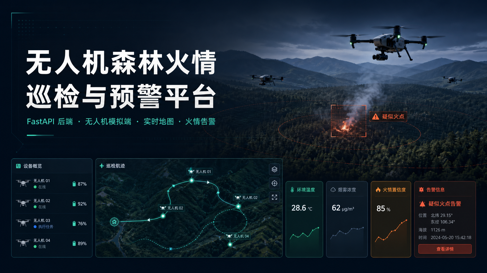

# 🔥 UAV Forest Fire Patrol & Early-Warning Platform
# 🔥 无人机森林火情巡检与预警平台

> A lightweight, full-stack platform that simulates a fleet of patrol drones, ingests their telemetry, applies rule-based fire detection, and visualizes drone status, flight tracks, and alerts in real time.
>
> 一个轻量级全栈平台：模拟多架无人机定时巡航并上报遥测数据，后端按规则识别火情并生成告警，前端实时展示无人机状态、巡检轨迹与告警中心。

---

## 📖 Overview / 项目简介

**English**

This project demonstrates an end-to-end "sense → report → detect → warn → visualize" pipeline for forest-fire monitoring with unmanned aerial vehicles (UAVs):

- **Drone simulator** registers 5 virtual drones and continuously reports position (`lat/lng`), battery, temperature, smoke level, and fire-confidence at a fixed heartbeat interval.
- **Backend (FastAPI)** receives telemetry, stores it in memory, evaluates rule-based thresholds, and raises `low / medium / high` fire alerts.
- **Frontend (single-page command center)** polls the backend every 2 seconds and renders three tabs: a drone list, a patrol map with live tracks, and an alert center.

The whole stack runs locally with **one double-click** — no Node.js required, dependencies are isolated in a project-local virtual environment, and a Docker Compose option is also provided.

**中文**

本项目完整演示了一条"感知 → 上报 → 识别 → 预警 → 可视化"的无人机森林火情监测链路:

- **无人机模拟端**注册 5 架虚拟无人机,按固定心跳间隔持续上报位置(`lat/lng`)、电量、温度、烟雾浓度与火情置信度。
- **后端(FastAPI)**接收遥测数据并存入内存,按规则阈值判定,生成 `low / medium / high` 三档火情告警。
- **前端(单页指挥中心)**每 2 秒轮询后端,通过三个标签页展示:无人机列表、带实时轨迹的巡检地图、告警中心。

整套系统本地**双击即可启动**——无需 Node.js,依赖隔离在项目本地虚拟环境中,同时另提供 Docker Compose 一键启动方案。

---

## ✨ Features / 功能特性

| Feature / 功能 | Description / 说明 |
| --- | --- |
| 🛰️ Multi-drone simulation / 多机模拟 | 5 drones auto-register and cruise with realistic telemetry / 5 架无人机自动注册并巡航,模拟真实遥测 |
| 📡 Real-time telemetry / 实时遥测 | Position, battery, temperature, smoke, fire-confidence / 位置、电量、温度、烟雾、火情置信度 |
| 🚨 Rule-based alerts / 规则告警 | Three severity levels: low / medium / high / 三档告警:低 / 中 / 高 |
| 🗺️ Live map & tracks / 实时地图轨迹 | Patrol routes drawn and updated continuously / 巡检轨迹持续绘制更新 |
| 🖥️ One-click launch / 一键启动 | Silent background start via `start.vbs`, no console window / 双击 `start.vbs` 后台静默启动,无黑窗 |
| 🐳 Docker option / 容器化 | `docker-compose up --build` with zero local Python / 一条命令拉起,本机免装 Python |

---

## 🏗️ Architecture / 系统架构

```
┌──────────────────┐      telemetry / 遥测       ┌──────────────────┐
│  Drone Simulator │ ──────────────────────────> │  Backend (FastAPI)│
│  无人机模拟端     │   POST /api/telemetry        │  后端服务          │
│  (5 drones)      │ <────────────────────────── │  :8000            │
└──────────────────┘   heartbeat / register      └─────────┬────────┘
                                                            │  REST API
                                                            │  (poll every 2s)
                                                            ▼
                                                  ┌──────────────────┐
                                                  │  Frontend (SPA)   │
                                                  │  前端指挥中心      │
                                                  │  :5500            │
                                                  └──────────────────┘
```

- **Data flow / 数据流**: simulator reports telemetry → backend stores in-memory & runs detection rules → frontend polls and visualizes. / 模拟端上报 → 后端内存存储并执行检测规则 → 前端轮询并可视化。
- **Detection / 检测规则**: thresholds on `temperature`, `smoke`, and `fire_confidence` map to `low/medium/high`. / 依据 `temperature`、`smoke`、`fire_confidence` 阈值映射到三档告警。
- Detailed contract and design: see [`API_CONTRACT.md`](./API_CONTRACT.md) and [`ARCHITECTURE.md`](./ARCHITECTURE.md). / 详细接口契约与设计见 [`API_CONTRACT.md`](./API_CONTRACT.md) 与 [`ARCHITECTURE.md`](./ARCHITECTURE.md)。

## 🧰 Tech Stack / 技术栈

- **Backend / 后端**: Python 3.9+ · FastAPI · Uvicorn · Pydantic
- **Frontend / 前端**: vanilla HTML / CSS / JavaScript (no framework, served via Python `http.server`) / 原生三件套(无框架,Python 静态服务)
- **Simulator / 模拟端**: Python · `requests`
- **Storage / 存储**: in-memory (resets on backend restart) / 内存存储(后端重启即清空)
- **Container / 容器**: Docker · Docker Compose

---

## ⚙️ Requirements / 环境要求

- **Python 3.9+** (verified on 3.11; frontend uses the built-in `http.server`, **no Node.js needed**) / 开发验证于 3.11,前端用 Python 自带 `http.server`,**无需 Node**
- Dependencies in [`requirements.txt`](./requirements.txt): `fastapi / uvicorn / pydantic / requests`
- **OS / 操作系统**: Windows for the one-click scripts (`start.bat` etc.); Linux/macOS can use the manual steps below / 一键脚本为 Windows 批处理,Linux/macOS 可用下方手动步骤
- **Ports / 端口**: backend **8000**, frontend **5500** (free them first if occupied, or adjust in `backend/config.py`) / 后端 8000、前端 5500,被占用时先释放或在 `backend/config.py` 调整

---

## 🚀 Getting Started / 启动方式

### Option 1 — One-click (recommended) / 方式一:一键启动(推荐)

**Double-click `start.vbs`.** It launches everything silently in the background (**no black cmd window**) and opens the browser once services are ready.

**双击 `start.vbs`** 即可。它在后台**静默**启动全部服务(**不弹任何黑窗**),等服务就绪后自动打开浏览器。

The underlying logic in `scripts/start_services.ps1` will: / 底层脚本 `scripts/start_services.ps1` 会自动完成:

1. Detect the Python command (`python`, fallback `py`). / 探测 Python 命令(优先 `python`,回退 `py`)。
2. Check/create the project-local **`.venv`** — system Python stays clean. / 检查或创建项目本地 **`.venv`**,不污染系统全局 Python。
3. `pip install -r requirements.txt` inside `.venv`. / 在 `.venv` 内安装依赖。
4. Start backend (FastAPI, port 8000), logs → `logs\backend.log`. / 后台启动后端,日志写入 `logs\backend.log`。
5. Start frontend static server (port 5500), logs → `logs\frontend.log`. / 后台启动前端静态服务,日志写入 `logs\frontend.log`。
6. Start the drone simulator (auto-register & report), logs → `logs\simulator.log`. / 后台启动无人机模拟端,日志写入 `logs\simulator.log`。
7. Wait until **both** ports 8000 & 5500 are ready, then open `http://localhost:5500`. / 等两个端口都就绪后,自动打开浏览器。

Background PIDs are written to `logs\pids.txt` for `stop.bat`. / 各进程 PID 写入 `logs\pids.txt`,供 `stop.bat` 停止使用。

| Purpose / 用途 | Entry / 入口 | Notes / 说明 |
| --- | --- | --- |
| Demo (recommended) / 普通演示(推荐) | `start.vbs` | Silent background start, auto-opens browser / 无黑窗,后台静默,就绪后自动开浏览器 |
| Debug / 排错调试 | `start_debug.bat` or `start.bat` | Visible consoles showing live output / 可见窗口显示各服务实时输出 |
| Stop / 停止服务 | `stop.bat` | Triple cleanup by PID, project `.venv` process, and ports / 三重清理:按 PID、本项目 `.venv` 进程、端口兜底 |

### Option 2 — Manual / 方式二:手动分步启动

```bash
# 0) Install deps (project root) / 安装依赖(项目根目录)
pip install -r requirements.txt

# 1) Backend (port 8000) / 启动后端
cd backend && python app.py

# 2) Frontend static server (new terminal) / 前端静态服务(另开终端)
cd frontend && python -m http.server 5500

# 3) Drone simulator (another terminal) / 无人机模拟端(再开终端)
cd drone-simulator && python simulator.py
```

Suggested order: backend → frontend → simulator (the simulator retries until the backend is up, so order is flexible). / 建议顺序:后端 → 前端 → 模拟端(模拟端内置等待重试,先起也可以)。

### Option 3 — Docker / 方式三:Docker 一键启动

```bash
docker-compose up --build
```

- `backend`: built from `backend/Dockerfile` (python:3.11-slim), exposes 8000. / 构建自 `backend/Dockerfile`,暴露 8000。
- `simulator`: connects via `PLATFORM_URL=http://backend:8000`. / 通过服务名连后端。
- `frontend`: nginx:alpine serving `frontend/`, mapped to host 5500. / nginx 挂载静态文件,映射到宿主 5500。

Stop with `Ctrl+C` then `docker-compose down`. / 停止:`Ctrl+C` 后 `docker-compose down`。

---

## 🌐 Access / 访问地址

- **Frontend / 前端**: http://localhost:5500 — single-page command center (drone list / patrol map / alert center, auto-refresh every 2s). / 单页指挥中心(三个标签页,每 2 秒刷新)。
- **Backend root / 后端根**: http://localhost:8000 — `GET /` returns service status & endpoint list. / 返回服务状态与接口清单。
- **API docs / 接口文档**: http://localhost:8000/docs — Swagger UI to debug all 9 endpoints. / Swagger 交互文档,可在线调试全部 9 个接口。

### Verify the simulator is working / 验证模拟端在工作

After the simulator starts, use these endpoints to confirm it keeps registering and reporting. / 启动模拟端后,用以下接口确认它正在持续注册并上报。

| Goal / 验证目的 | Endpoint / 接口 | Expected / 预期现象 |
| --- | --- | --- |
| Drones online / 模拟端已注册并在线 | `GET /api/drones` | 5 drones with `status = cruising`; refresh to see values change / 5 架无人机,状态为 `cruising`,刷新可见数据变化 |
| Tracks growing / 巡检轨迹在增长 | `GET /api/drones/{id}/track?limit=100` | `track` array keeps adding points / `track` 数组不断新增点位 |
| Alerts produced / 火情告警在产生 | `GET /api/alerts?status=all` | low/medium/high alerts appear over time / 运行一段时间后出现三档告警 |

**Endpoint base / 接口前缀**: all endpoints above are under `http://localhost:8000`. / 以上接口均以 `http://localhost:8000` 为前缀。

**Each track point contains / 每个轨迹点包含**: `lat`, `lng`, `timestamp`, `temperature`, `smoke`, `fire_confidence`.

**Manual trigger / 手动触发告警**: run `scripts/demo_trigger.py`, or report `temperature=95` / `fire_confidence=0.9` to `/api/telemetry`. / 运行 `scripts/demo_trigger.py`,或向 `/api/telemetry` 上报 `temperature=95` / `fire_confidence=0.9`。

> Tip / 小贴士: refresh `GET /api/drones` a few times in the browser — if coordinates and battery change, the heartbeat & reporting pipeline is healthy. / 多刷新几次,看到经纬度和电量在变,就说明心跳与上报链路正常。

---

## ✅ Notes for Reviewers / 验收提示

- **In-memory storage — data resets on backend restart.** Keep the backend running during a demo. / **数据为内存存储,重启后端即清空**,演示时请勿中途重启后端。
- The simulator randomly injects abnormal values, so `low/medium/high` alerts appear naturally after a short run. / 模拟端按概率制造异常值,运行一会儿后会自然出现三档告警。
- Fastest way to force a `high` alert: report `temperature=95` or `fire_confidence=0.9` to `/api/telemetry`. / 想快速制造 high 告警:对 `/api/telemetry` 上报 `temperature=95` 或 `fire_confidence=0.9`。
- The authoritative contract is [`API_CONTRACT.md`](./API_CONTRACT.md); all fields are `snake_case`. / 接口契约以 [`API_CONTRACT.md`](./API_CONTRACT.md) 为准,字段全部 snake_case。

---

## 📂 Project Structure / 项目结构

```
forest-fire-platform/
├── backend/            # FastAPI service / 后端服务
├── drone-simulator/    # UAV telemetry simulator / 无人机模拟端
├── frontend/           # Single-page command center / 单页前端
├── scripts/            # Start/stop & helper scripts / 启动停止与辅助脚本
├── docs/               # Project log & docs / 项目日志与文档
├── API_CONTRACT.md     # API contract / 接口契约
├── ARCHITECTURE.md     # Architecture & design / 架构设计
├── AI_PROMPTS.md       # AI prompt records / AI 提示词记录
├── DEMO.md             # Demo guide / 演示指引
├── docker-compose.yml  # Docker orchestration / 容器编排
└── start.vbs / start.bat / stop.bat  # One-click scripts / 一键脚本
```

---

## 📄 Documentation / 相关文档

- [`ARCHITECTURE.md`](./ARCHITECTURE.md) — architecture & design decisions / 架构与设计决策
- [`API_CONTRACT.md`](./API_CONTRACT.md) — full API contract / 完整接口契约
- [`AI_PROMPTS.md`](./AI_PROMPTS.md) — AI prompt records / AI 提示词记录
- [`DEMO.md`](./DEMO.md) — demo walkthrough / 演示流程
