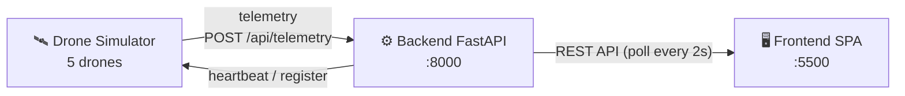

<a id="top"></a>


# 🔥 无人机森林火情巡检与预警平台 · UAV Forest Fire Patrol & Early-Warning Platform

**🌐 语言 / Language:**　**简体中文（默认）**　|　[English](#-english)

> 一个轻量级全栈平台：模拟多架无人机定时巡航并上报遥测数据，后端按规则识别火情并生成告警，前端实时展示无人机状态、巡检轨迹与告警中心。

---

## 📖 项目简介

本项目完整演示了一条"感知 → 上报 → 识别 → 预警 → 可视化"的无人机森林火情监测链路：

- **无人机模拟端**注册 5 架虚拟无人机，按固定心跳间隔持续上报位置（`lat/lng`）、电量、温度、烟雾浓度与火情置信度。
- **后端（FastAPI）**接收遥测数据并存入内存，按规则阈值判定，生成 `low / medium / high` 三档火情告警。
- **前端（单页指挥中心）**每 2 秒轮询后端，通过三个标签页展示：无人机列表、带实时轨迹的巡检地图、告警中心。

整套系统本地**双击即可启动**——无需 Node.js，依赖隔离在项目本地虚拟环境中，同时另提供 Docker Compose 一键启动方案。

## ✨ 功能特性

| 功能 | 说明 |
| --- | --- |
| 🛰️ 多机模拟 | 5 架无人机自动注册并巡航，模拟真实遥测数据 |
| 📡 实时遥测 | 上报位置、电量、温度、烟雾浓度、火情置信度 |
| 🚨 规则告警 | 三档火情告警：低 / 中 / 高 |
| 🗺️ 实时地图轨迹 | 巡检轨迹持续绘制与更新 |
| 🖥️ 一键启动 | 双击 `start.vbs` 后台静默启动，无黑窗 |
| 🐳 容器化 | `docker-compose up --build` 一条命令拉起，本机免装 Python |

## 🏗️ 系统架构


- **数据流**：模拟端上报 → 后端内存存储并执行检测规则 → 前端轮询并可视化。
- **检测规则**：依据 `temperature`、`smoke`、`fire_confidence` 阈值映射到三档告警。
- 详细接口契约与设计见 [`API_CONTRACT.md`](./API_CONTRACT.md) 与 [`ARCHITECTURE.md`](./ARCHITECTURE.md)。

## 🧰 技术栈

- **后端**：Python 3.9+ · FastAPI · Uvicorn · Pydantic
- **前端**：原生 HTML / CSS / JavaScript（无框架，用 Python `http.server` 提供静态服务）
- **模拟端**：Python · `requests`
- **存储**：内存存储（后端重启即清空）
- **容器**：Docker · Docker Compose

## ⚙️ 环境要求

- **Python 3.9+**（开发验证于 3.11；前端用 Python 自带 `http.server`，**无需 Node**）
- 依赖见 [`requirements.txt`](./requirements.txt)：`fastapi / uvicorn / pydantic / requests`
- **操作系统**：一键脚本为 Windows 批处理（`start.bat` 等）；Linux/macOS 可用下方手动步骤
- **端口**：后端 **8000**、前端 **5500**（被占用时先释放，或在 `backend/config.py` 调整）

## 🚀 启动方式

### 方式一：一键启动（推荐）

**双击 `start.vbs`** 即可。它在后台**静默**启动全部服务（**不弹任何黑窗**），等服务就绪后自动打开浏览器。底层脚本 `scripts/start_services.ps1` 会自动完成：

1. 探测 Python 命令（优先 `python`，回退 `py`）。
2. 检查或创建项目本地 **`.venv`**，不污染系统全局 Python。
3. 在 `.venv` 内 `pip install -r requirements.txt`。
4. 后台启动后端（FastAPI，端口 8000），日志写入 `logs\backend.log`。
5. 后台启动前端静态服务（端口 5500），日志写入 `logs\frontend.log`。
6. 后台启动无人机模拟端（自动注册并上报），日志写入 `logs\simulator.log`。
7. 等两个端口 8000 与 5500 都就绪后，自动打开 `http://localhost:5500`。

各进程 PID 写入 `logs\pids.txt`，供 `stop.bat` 停止使用。

| 用途 | 入口 | 说明 |
| --- | --- | --- |
| 普通演示（推荐） | `start.vbs` | 无黑窗，后台静默启动，就绪后自动开浏览器 |
| 排错调试 | `start_debug.bat` 或 `start.bat` | 可见窗口显示各服务实时输出 |
| 停止服务 | `stop.bat` | 三重清理：按 PID、本项目 `.venv` 进程、端口兜底 |

### 方式二：手动分步启动

```bash
# 0) 安装依赖（项目根目录）
pip install -r requirements.txt

# 1) 启动后端（端口 8000）
cd backend && python app.py

# 2) 前端静态服务（另开终端）
cd frontend && python -m http.server 5500

# 3) 无人机模拟端（再开终端）
cd drone-simulator && python simulator.py
```

建议顺序：后端 → 前端 → 模拟端（模拟端内置等待重试，先起也可以）。

### 方式三：Docker 一键启动

```bash
docker-compose up --build
```

- `backend`：构建自 `backend/Dockerfile`（python:3.11-slim），暴露 8000。
- `simulator`：通过 `PLATFORM_URL=http://backend:8000` 用服务名连后端。
- `frontend`：nginx:alpine 挂载 `frontend/` 静态文件，映射到宿主 5500。

停止：`Ctrl+C` 后 `docker-compose down`。

## 🌐 访问地址

- **前端**：<http://localhost:5500> — 单页指挥中心（无人机列表 / 巡检地图 / 告警中心，每 2 秒刷新）。
- **后端根**：<http://localhost:8000> — `GET /` 返回服务状态与接口清单。
- **接口文档**：<http://localhost:8000/docs> — Swagger 交互文档，可在线调试全部 9 个接口。

### 验证模拟端在工作

启动模拟端后，用以下接口确认它正在持续注册并上报（接口均以 `http://localhost:8000` 为前缀）：

| 验证目的 | 接口 | 预期现象 |
| --- | --- | --- |
| 模拟端已注册并在线 | `GET /api/drones` | 5 架无人机，状态为 `cruising`，刷新可见数据变化 |
| 巡检轨迹在增长 | `GET /api/drones/{id}/track?limit=100` | `track` 数组不断新增点位 |
| 火情告警在产生 | `GET /api/alerts?status=all` | 运行一段时间后出现 low/medium/high 三档告警 |

- **每个轨迹点包含**：`lat`、`lng`、`timestamp`、`temperature`、`smoke`、`fire_confidence`。
- **手动触发告警**：运行 `scripts/demo_trigger.py`，或向 `/api/telemetry` 上报 `temperature=95` / `fire_confidence=0.9`。
- **小贴士**：多刷新几次 `GET /api/drones`，看到经纬度和电量在变，就说明心跳与上报链路正常。

## ✅ 验收提示

- **数据为内存存储，重启后端即清空**，演示时请勿中途重启后端。
- 模拟端按概率制造异常值，运行一会儿后会自然出现三档告警。
- 想快速制造 high 告警：对 `/api/telemetry` 上报 `temperature=95` 或 `fire_confidence=0.9`。
- 接口契约以 [`API_CONTRACT.md`](./API_CONTRACT.md) 为准，字段全部 snake_case。

## 📂 项目结构

```text
forest-fire-platform/
├── backend/            # 后端服务（FastAPI）
├── drone-simulator/    # 无人机遥测模拟端
├── frontend/           # 单页前端指挥中心
├── scripts/            # 启动停止与辅助脚本
├── docs/               # 项目日志与文档
├── API_CONTRACT.md     # 接口契约
├── ARCHITECTURE.md     # 架构设计
├── AI_PROMPTS.md       # AI 提示词记录
├── DEMO.md             # 演示指引
├── docker-compose.yml  # 容器编排
└── start.vbs / start.bat / stop.bat  # 一键脚本
```

## 📄 相关文档

- [`ARCHITECTURE.md`](./ARCHITECTURE.md) — 架构与设计决策
- [`API_CONTRACT.md`](./API_CONTRACT.md) — 完整接口契约
- [`AI_PROMPTS.md`](./AI_PROMPTS.md) — AI 提示词记录
- [`DEMO.md`](./DEMO.md) — 演示流程

<br/>

---

<a id="-english"></a>

# 🔥 English

**🌐 语言 / Language:**　[简体中文](#top)　|　**English**

> A lightweight, full-stack platform that simulates a fleet of patrol drones, ingests their telemetry, applies rule-based fire detection, and visualizes drone status, flight tracks, and alerts in real time.

## 📖 Overview

This project demonstrates an end-to-end "sense → report → detect → warn → visualize" pipeline for forest-fire monitoring with unmanned aerial vehicles (UAVs):

- The **drone simulator** registers 5 virtual drones and continuously reports position (`lat/lng`), battery, temperature, smoke level, and fire-confidence at a fixed heartbeat interval.
- The **backend (FastAPI)** receives telemetry, stores it in memory, evaluates rule-based thresholds, and raises `low / medium / high` fire alerts.
- The **frontend (single-page command center)** polls the backend every 2 seconds and renders three tabs: a drone list, a patrol map with live tracks, and an alert center.

The whole stack runs locally with **one double-click** — no Node.js required, dependencies are isolated in a project-local virtual environment, and a Docker Compose option is also provided.

## ✨ Features

| Feature | Description |
| --- | --- |
| 🛰️ Multi-drone simulation | 5 drones auto-register and cruise with realistic telemetry |
| 📡 Real-time telemetry | Reports position, battery, temperature, smoke, fire-confidence |
| 🚨 Rule-based alerts | Three severity levels: low / medium / high |
| 🗺️ Live map & tracks | Patrol routes drawn and updated continuously |
| 🖥️ One-click launch | Silent background start via `start.vbs`, no console window |
| 🐳 Docker option | `docker-compose up --build` with zero local Python |

## 🏗️ Architecture



- **Data flow**: simulator reports telemetry → backend stores in-memory & runs detection rules → frontend polls and visualizes.
- **Detection**: thresholds on `temperature`, `smoke`, and `fire_confidence` map to `low/medium/high`.
- See [`API_CONTRACT.md`](./API_CONTRACT.md) and [`ARCHITECTURE.md`](./ARCHITECTURE.md) for the full contract and design.

## 🧰 Tech Stack

- **Backend**: Python 3.9+ · FastAPI · Uvicorn · Pydantic
- **Frontend**: vanilla HTML / CSS / JavaScript (no framework, served via Python `http.server`)
- **Simulator**: Python · `requests`
- **Storage**: in-memory (resets on backend restart)
- **Container**: Docker · Docker Compose

## ⚙️ Requirements

- **Python 3.9+** (verified on 3.11; frontend uses the built-in `http.server`, **no Node.js needed**)
- Dependencies in [`requirements.txt`](./requirements.txt): `fastapi / uvicorn / pydantic / requests`
- **OS**: Windows for the one-click scripts (`start.bat` etc.); Linux/macOS can use the manual steps below
- **Ports**: backend **8000**, frontend **5500** (free them first if occupied, or adjust in `backend/config.py`)

## 🚀 Getting Started

### Option 1 — One-click (recommended)

**Double-click `start.vbs`.** It launches everything silently in the background (**no black cmd window**) and opens the browser once services are ready. The underlying `scripts/start_services.ps1` will:

1. Detect the Python command (`python`, fallback `py`).
2. Check/create the project-local **`.venv`** — system Python stays clean.
3. `pip install -r requirements.txt` inside `.venv`.
4. Start the backend (FastAPI, port 8000), logs → `logs\backend.log`.
5. Start the frontend static server (port 5500), logs → `logs\frontend.log`.
6. Start the drone simulator (auto-register & report), logs → `logs\simulator.log`.
7. Wait until **both** ports 8000 & 5500 are ready, then open `http://localhost:5500`.

Background PIDs are written to `logs\pids.txt` for `stop.bat`.

| Purpose | Entry | Notes |
| --- | --- | --- |
| Demo (recommended) | `start.vbs` | Silent background start, auto-opens browser |
| Debug | `start_debug.bat` or `start.bat` | Visible consoles showing live output |
| Stop | `stop.bat` | Triple cleanup by PID, project `.venv` process, and ports |

### Option 2 — Manual

```bash
# 0) Install deps (project root)
pip install -r requirements.txt

# 1) Backend (port 8000)
cd backend && python app.py

# 2) Frontend static server (new terminal)
cd frontend && python -m http.server 5500

# 3) Drone simulator (another terminal)
cd drone-simulator && python simulator.py
```

Suggested order: backend → frontend → simulator (the simulator retries until the backend is up, so order is flexible).

### Option 3 — Docker

```bash
docker-compose up --build
```

- `backend`: built from `backend/Dockerfile` (python:3.11-slim), exposes 8000.
- `simulator`: connects via `PLATFORM_URL=http://backend:8000`.
- `frontend`: nginx:alpine serving `frontend/`, mapped to host 5500.

Stop with `Ctrl+C` then `docker-compose down`.

## 🌐 Access

- **Frontend**: <http://localhost:5500> — single-page command center (drone list / patrol map / alert center, auto-refresh every 2s).
- **Backend root**: <http://localhost:8000> — `GET /` returns service status & endpoint list.
- **API docs**: <http://localhost:8000/docs> — Swagger UI to debug all 9 endpoints.

### Verify the simulator is working

After the simulator starts, use these endpoints to confirm it keeps registering and reporting (all under `http://localhost:8000`):

| Goal | Endpoint | Expected |
| --- | --- | --- |
| Drones online | `GET /api/drones` | 5 drones with `status = cruising`; refresh to see values change |
| Tracks growing | `GET /api/drones/{id}/track?limit=100` | `track` array keeps adding points |
| Alerts produced | `GET /api/alerts?status=all` | low/medium/high alerts appear over time |

- **Each track point contains**: `lat`, `lng`, `timestamp`, `temperature`, `smoke`, `fire_confidence`.
- **Manual trigger**: run `scripts/demo_trigger.py`, or report `temperature=95` / `fire_confidence=0.9` to `/api/telemetry`.
- **Tip**: refresh `GET /api/drones` a few times — if coordinates and battery change, the heartbeat & reporting pipeline is healthy.

## ✅ Notes for Reviewers

- **In-memory storage — data resets on backend restart.** Keep the backend running during a demo.
- The simulator randomly injects abnormal values, so `low/medium/high` alerts appear naturally after a short run.
- Fastest way to force a `high` alert: report `temperature=95` or `fire_confidence=0.9` to `/api/telemetry`.
- The authoritative contract is [`API_CONTRACT.md`](./API_CONTRACT.md); all fields are `snake_case`.

## 📂 Project Structure

```text
forest-fire-platform/
├── backend/            # FastAPI service
├── drone-simulator/    # UAV telemetry simulator
├── frontend/           # Single-page command center
├── scripts/            # Start/stop & helper scripts
├── docs/               # Project log & docs
├── API_CONTRACT.md     # API contract
├── ARCHITECTURE.md     # Architecture & design
├── AI_PROMPTS.md       # AI prompt records
├── DEMO.md             # Demo guide
├── docker-compose.yml  # Docker orchestration
└── start.vbs / start.bat / stop.bat  # One-click scripts
```

## 📄 Documentation

- [`ARCHITECTURE.md`](./ARCHITECTURE.md) — architecture & design decisions
- [`API_CONTRACT.md`](./API_CONTRACT.md) — full API contract
- [`AI_PROMPTS.md`](./AI_PROMPTS.md) — AI prompt records
- [`DEMO.md`](./DEMO.md) — demo walkthrough

<br/>

[⬆️ 回到顶部 / Back to top](#top)
